# Final Term Project

Final Term Project for HXLS 

- by Tanmay Deshpande

### Tested with Python 3.8.5 only (64-bit)

## Modules Used:
- Os
- DateTime
- Questionary
- Tabulate
- Plotly
- csv
- pkg_resources
- sys
- subprocess

## Usage:

Download the entire repo as a zip or clone it using `git clone https://github.com/dsptanmay/Final-Term-Project.git`.

Run `src/main.py` to get started.

## Demo:

Images of program while it is running

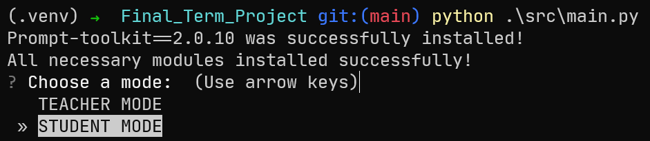

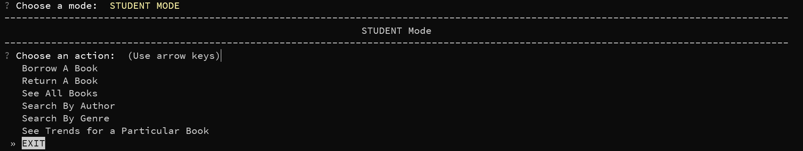

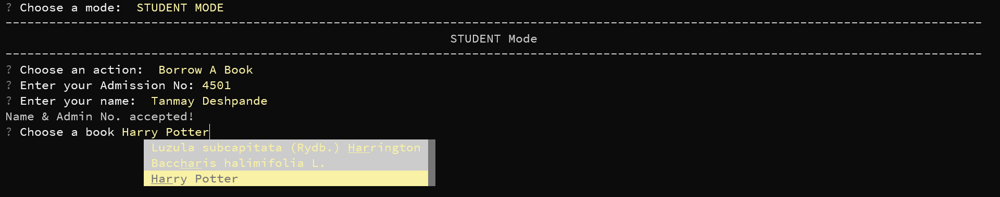

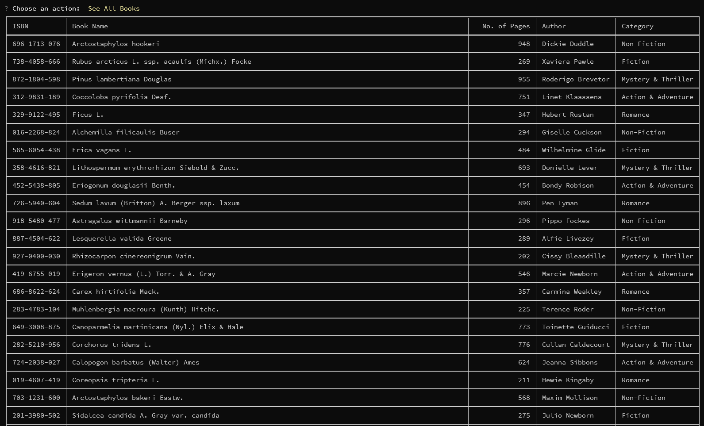

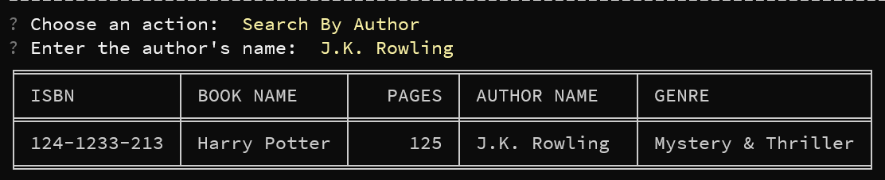

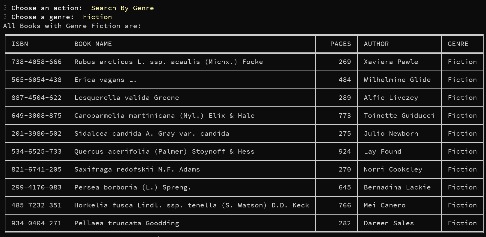

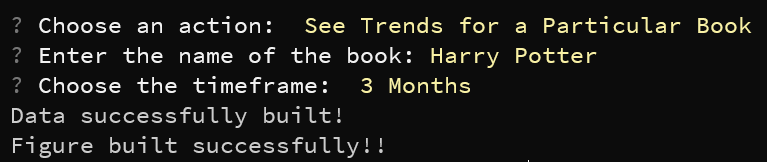

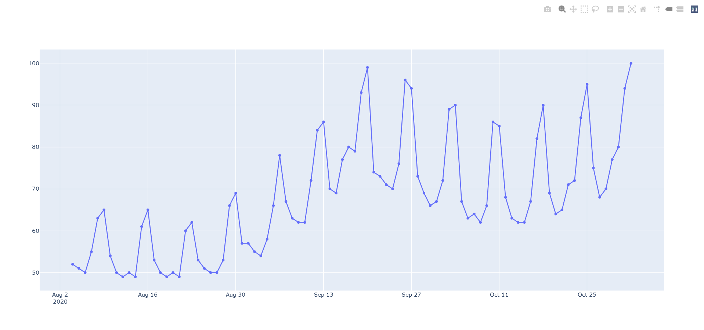

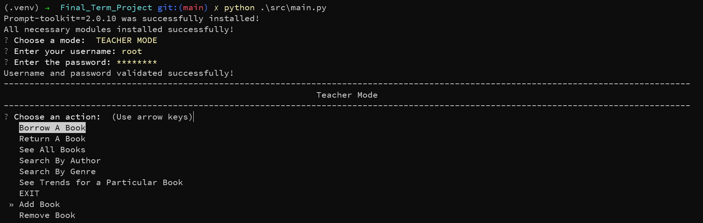

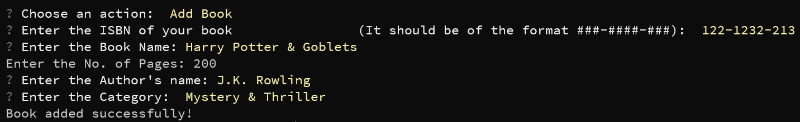

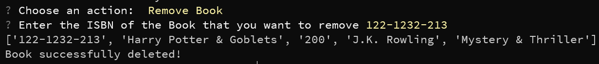

